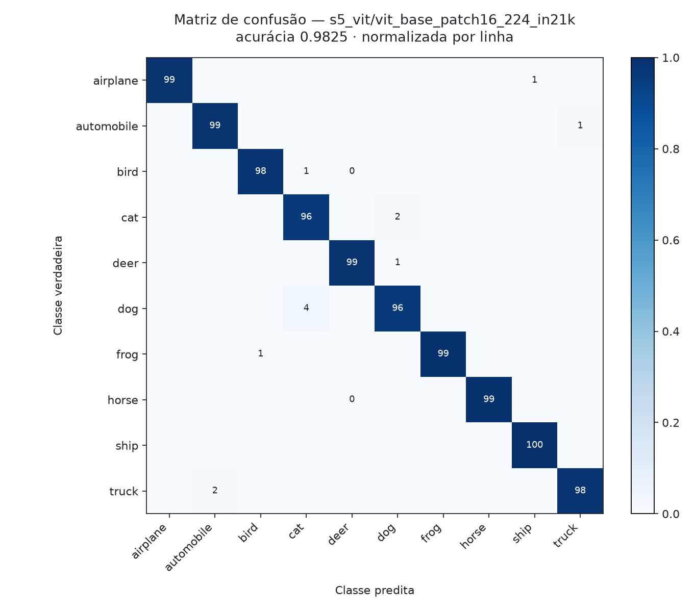
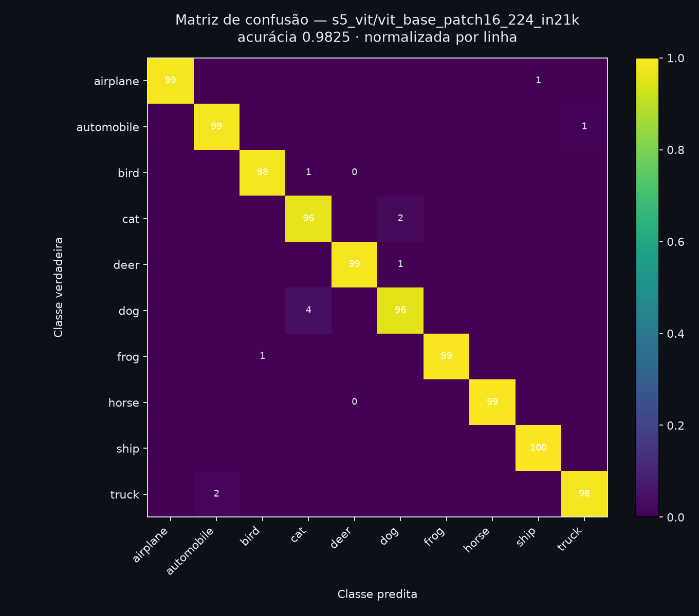

# Avaliação Prática 1 — Deep Models: CNN, Transfer Learning & Vision Transformers

> **Course:** Aprendizagem de Máquina · PPGIA / PUC-PR · MSc 2026
> **Instructor:** Prof. Alceu de Souza Britto Jr. (alceu@ppgia.pucpr.br)
> **Related module:** [Module 5 — Deep Techniques](../modules/05-deep.md)
> **Code:** [`activities/avaliacao-pratica-1/`](avaliacao-pratica-1/) · **Runner:** [`colab.ipynb`](avaliacao-pratica-1/colab.ipynb)

---

## Overview

Five strategies are compared for classifying CIFAR-10, spanning the full range from
"learn everything from the data at hand" to "inherit almost everything from a model
pretrained on 14 million images":

| # | Strategy | What is learned | What is inherited | Script |
|---|---|---|---|---|
| 1 | CNN from scratch | every weight | nothing | [`s1_cnn_scratch.py`](avaliacao-pratica-1/s1_cnn_scratch.py) |
| 2 | Pretrained CNN as feature extractor + shallow classifier | a shallow classifier | all convolutional filters | [`s2_feature_extraction.py`](avaliacao-pratica-1/s2_feature_extraction.py) |
| 3 | Fine-tuning a pretrained CNN | head + top block | early and mid-level filters | [`s3_finetuning.py`](avaliacao-pratica-1/s3_finetuning.py) |
| 4 | Fine-tuning + data augmentation | head + top block | same, plus an enlarged effective dataset | [`s4_augmentation.py`](avaliacao-pratica-1/s4_augmentation.py) |
| 5 | Fine-tuning a Vision Transformer | head + encoder | ImageNet-21k representations | [`s5_vit.py`](avaliacao-pratica-1/s5_vit.py) |

The interesting question is not which one wins — with 10,000 training images the answer
is nearly foreordained — but **what each increment of transfer actually buys, and at
what cost**. That framing is why every result below is reported alongside its input
resolution, trainable parameter count, and wall-clock training time.

### Dataset: CIFAR-10

| Property | Value |
|---|---|
| Source | `tf.keras.datasets.cifar10` (Krizhevsky, 2009) |
| Images | 60,000 colour images, 32×32×3 |
| Classes | 10, perfectly balanced (6,000 images each) |
| Official split | 50,000 train / 10,000 test |

Classes: `airplane`, `automobile`, `bird`, `cat`, `deer`, `dog`, `frog`, `horse`, `ship`, `truck`.
Note that `cat`/`dog` and `automobile`/`truck` are semantically adjacent pairs — the
confusion matrix of any model on this dataset is largely a story about those two pairs.

---

## Experimental Protocol

The protocol is defined once, in [`common.py`](avaliacao-pratica-1/common.py), and every strategy
imports it. Three decisions carry the comparison:

### 1. Equal budget

Every strategy trains on the **same stratified 10,000-image subsample** (1,000 per class),
validates on the **same 2,000 images**, and is scored **once** on the **full official
10,000-image test set**.

The subsample is not a shortcut — it is what makes the comparison legal. The five
strategies differ in cost by a factor of ~50 (a from-scratch CNN at 32×32 trains in
minutes; ViT-B/16 at 224×224 does not), and a free-tier T4 cannot afford the full 50,000
images across five strategies, three seeds and four ablations. Given that constraint, the
choice is between *all strategies on 10,000 images* and *some strategies on more data than
others*. The first is a fair experiment; the second is not an experiment at all.

The consequence must be stated openly rather than buried: **10,000 images is a low-data
regime, and low-data regimes are exactly where transfer learning is strongest.** A
from-scratch CNN would close much of the gap at 50,000 images. The ranking reported here
is a ranking *at this budget*, and the report says so.

### 2. The test set is touched once

Architecture, epochs, and early stopping are all selected on the validation split. The
test set produces exactly one number per configuration. There is no "best epoch on test",
no threshold tuned on test, and no configuration chosen because it looked good on test.

### 3. No claim rests on a single run

Every trained network is run at three seeds (42, 7, 2024) and reported as mean ± standard
deviation. The seed changes weight initialisation and augmentation sampling — never the
data, which is fixed by a separate RNG. A difference between two configurations that is
smaller than the seed-to-seed spread is not a result.

For the two best models, a **McNemar exact test** on paired test predictions decides
significance. This — not a Wilcoxon over folds — is the right test: both models are
evaluated on identical samples, so their errors are paired, and only the discordant
predictions carry information.

### Evaluation

Accuracy (primary), macro-F1, macro-precision, macro-recall, Wilson 95% confidence
interval, per-class accuracy, and the full confusion matrix. On a 10,000-image test set
the Wilson half-width at ~90% accuracy is about ±0.6 pp — **that is the resolution limit
of every claim in this report**, and differences below it are reported as ties.

---

## Departures from the lecture notebooks

The course examples ([`FeatureExtraction_v_new.ipynb`](../course-materials/notebooks/),
[`Aula10_FineTuning_CNN-1.ipynb`](../course-materials/notebooks/),
[`CNN_FineTuning_DataAugmentation.ipynb`](../course-materials/notebooks/)) are written for a
1,000-image dataset. Four departures were necessary, and each is a result in itself:

| Lecture notebook | This activity | Why |
|---|---|---|
| `np.save` of all images at 224×224 float32 | uint8 32×32 in RAM, resize on the fly in `tf.data` | 60,000 × 224² × 3 float32 ≈ **36 GB**. It does not fit, and it does not need to. |
| `backbone.trainable = False`, never unfrozen | Phase 1 frozen head, then **Phase 2** unfreezes the top block at 1e-5 | `trainable=False` throughout is feature extraction with a deep head — *not* fine-tuning. Strategy 3 is only strategy 3 if Phase 2 exists. |
| `ImageDataGenerator` (CPU) | Keras preprocessing layers inside the `tf.data` graph (GPU) | The CPU generator becomes the bottleneck once images are upsampled to 224×224; it is also deprecated in Keras 3. |
| Single 70/30 holdout, one run | Fixed splits, 3 seeds, McNemar on the top-2 pair | A single holdout gives a point estimate with no dispersion — nothing to test a difference against. |

A reference run reproducing the lecture setup exactly (VGG16 + `Flatten`, frozen backbone,
no Phase 2) is included so the report can quantify what the departures bought.

---

## Open Questions

The assignment attaches four open questions to the strategies. Each is answered as a
**controlled ablation**: one variable moves, everything else is pinned to the same data,
schedule, and seeds.

**Q2(a) — Does swapping the backbone for something simpler, like MobileNet, significantly
change the result?**
MobileNetV2 (3.5M params, 0.6 GFLOPs) vs ResNet50 (25.6M, 8.2) vs InceptionV3 (23.9M, 11.5),
with the classifier and the data held fixed. A ~14× parameter gap and ~19× compute gap.

**Q4(a) — Does replacing `Flatten()` with `GlobalMaxPooling2D()` significantly change the
result?**
Not a cosmetic choice. On MobileNetV2 at 224px the final feature map is 7×7×1280, so
`Flatten → Dense(512)` is **32.1M** head parameters against `GlobalMaxPool → Dense(512)`'s
**0.66M** — a 49× difference in head capacity, fitted on 10,000 images. Global average
pooling is included as a third arm.

**Q4(b) — Can changing the optimiser (`Adam()`) improve the result?**
Adam vs AdamW vs SGD+Nesterov vs RMSprop. SGD is given a 10× larger learning rate, because
comparing optimisers at a learning rate tuned for Adam is a rigged fight, not an experiment.

**Q4(c) — Can other data-augmentation strategies improve the result?**
Four policies, including the lecture notebook's own (`rotation 10°, zoom 0.15, shift 0.1`).
Note what that policy omits: **horizontal flip** — on CIFAR-10 the single most effective and
most obviously label-preserving transform available.

---

## Results

> Generated by [`report.py`](avaliacao-pratica-1/report.py) from the run artefacts in
> [`avaliacao-pratica-1/results/`](avaliacao-pratica-1/results/). Every JSON carries its own 10,000 test
> predictions, so the tables, the confusion matrix and the significance test can all be
> regenerated on a CPU without retraining anything.

### Strategy comparison

<!-- BEGIN GENERATED: main-table -->
_(pending — run `python run_all.py --stage core --stage seeds`)_
<!-- END GENERATED: main-table -->

### Statistical significance of the top-2 gap

<!-- BEGIN GENERATED: significance -->
_(pending)_
<!-- END GENERATED: significance -->

### Best model — confusion matrix

<p align="center">
  <picture class="github-mode-only">
    <source media="(prefers-color-scheme: dark)" srcset="../assets/img/avaliacao-pratica-1-confusion-dark.png">
    
  </picture>
  
  
</p>

<!-- BEGIN GENERATED: hardest-classes -->
_(pending)_
<!-- END GENERATED: hardest-classes -->

### Q2(a) — Backbone swap

<!-- BEGIN GENERATED: ablation-backbone -->
_(pending — run `python s2_feature_extraction.py --ablation`)_
<!-- END GENERATED: ablation-backbone -->

### Q4(a) — `Flatten()` vs `GlobalMaxPooling2D()`

<!-- BEGIN GENERATED: ablation-head -->
_(pending — run `python s3_finetuning.py --ablation-head`)_
<!-- END GENERATED: ablation-head -->

### Q4(b) — Optimiser

<!-- BEGIN GENERATED: ablation-optimizer -->
_(pending — run `python s4_augmentation.py --ablation-optimizer`)_
<!-- END GENERATED: ablation-optimizer -->

### Q4(c) — Augmentation policy

<!-- BEGIN GENERATED: ablation-policy -->
_(pending — run `python s4_augmentation.py --ablation-policy`)_
<!-- END GENERATED: ablation-policy -->

---

## Reproducing

```bash
cd activities/avaliacao-pratica-1
pip install -r requirements.txt

python run_all.py --stage core        # 5 strategies, primary seed   (~70 min, T4)
python run_all.py --stage seeds       # 3 seeds for the trained nets (~2 h)
python run_all.py --stage ablations   # the four open questions      (~2.5 h)
python run_all.py --stage baseline    # the lecture notebook's setup (~20 min)
python report.py                      # tables + confusion matrix    (~10 s, CPU)
```

On Colab, open [`colab.ipynb`](avaliacao-pratica-1/colab.ipynb), select a T4 runtime, and run the
cells: it clones this repository and calls the same scripts. The notebook is the execution
environment; the scripts are the artefact.

---

*[← README](../README.md) · [Module 5 — Deep Techniques](../modules/05-deep.md) · [Answers (pt-BR)](avaliacao-pratica-1-respostas.md)*
