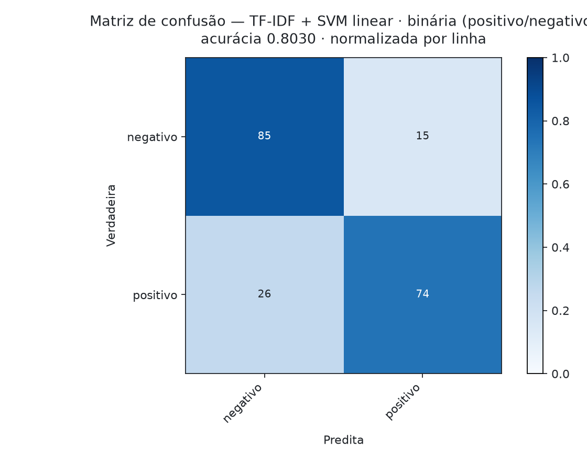
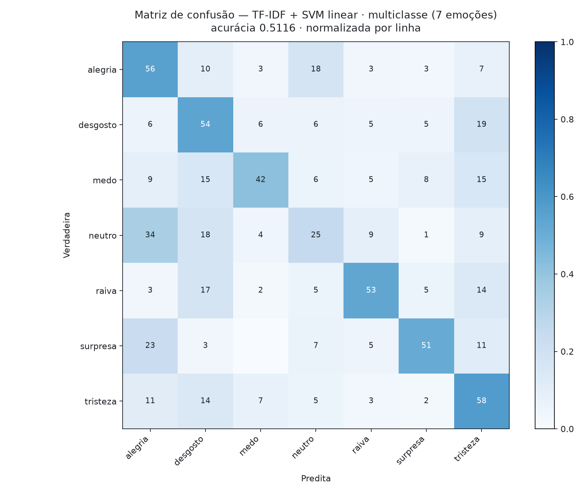

# Avaliação Prática 2 — Classificação de Texto (LSTM vs Transformer): Respostas

> **Disciplina:** Aprendizagem de Máquina · PPGIA / PUC-PR · Mestrado 2026
> **Aluno:** Fernando Dantas
> **Reprodutibilidade:** todos os valores foram gerados pelos scripts listados na seção *Scripts* (semente primária 42); o relatório é regenerado a partir dos artefatos de resultado por [`report.py`](https://github.com/fsd-dantas/machine-learning-fundamentals/blob/main/activities/avaliacao-pratica-2/report.py).

---

## Preparação da Base

A base fornecida consiste em dois arquivos (`g1_v1_ws.csv`, com 982 registros, e `g1_v2_ws.csv`, com 1.750), contendo manchetes jornalísticas anotadas com emoções. Conforme o enunciado, os arquivos foram concatenados em uma única base. Três características do material exigiram tratamento antes de qualquer treinamento, e cada uma constitui um achado, não mera higienização.

**Duplicação (292 registros; 10,7%).** A concatenação produz 2.732 registros, mas apenas 2.440 textos distintos. Caso a partição *holdout* fosse realizada antes da deduplicação, um texto e sua cópia poderiam ser alocados, respectivamente, ao treinamento e ao teste — o modelo seria então avaliado sobre material que memorizou, e a acurácia reportada estaria inflada em magnitude não recuperável *a posteriori*. **A deduplicação precede a partição.** Adotou-se como chave o texto normalizado (minúsculas, espaçamento colapsado): variações apenas de caixa ou espaçamento constituem o mesmo texto e vazariam com igual eficácia.

**Conflito de rótulos (4 textos).** Quatro textos ocorrem com emoções distintas. Cabe registrar a natureza do conflito: **todas as quatro discordâncias são internas à valência negativa** (raiva/desgosto; desgosto/medo; tristeza/medo). Os anotadores divergem sobre *qual* emoção negativa se manifesta, jamais sobre a valência do texto. Disso decorre que a tarefa binária está livre desse ruído, ao passo que a tarefa multiclasse carrega **ruído de rótulo irredutível**, concentrado precisamente na região em que sua matriz de confusão apresentará maior sangria: entre medo, desgosto, raiva e tristeza. Os quatro textos foram descartados de todas as tarefas, restando **2.436**.

**Codificação.** Os arquivos estão em `latin-1`, não em UTF-8, e utilizam `;` como delimitador com uma coluna espúria entre aspas (`texto;";";classe`). A leitura como UTF-8 falha; a leitura descuidada produz *mojibake*, e a LSTM passaria a aprender um vocabulário de tokens corrompidos.

**Mapeamento binário.** O enunciado não define como converter as sete emoções em duas classes; o notebook da disciplina o faz: `neutro`, `alegria` e `surpresa` → *positivo*; `medo`, `raiva`, `desgosto` e `tristeza` → *negativo*. O mapeamento é semanticamente discutível — *neutro* não é positivo, e *surpresa* não possui valência fixa (pode ser deleite ou horror). Adotou-se o mapeamento do professor como resultado principal, por ser o que torna o número comparável ao da turma, e executou-se adicionalmente uma **análise de sensibilidade** descartando `neutro` e `surpresa` (seção final). Se o veredito LSTM *versus* BERT se mantiver sob ambos os mapeamentos, a conclusão não repousa sobre uma decisão de rotulagem alheia ao experimento.

Distribuição após o tratamento: **binária** — negativo 1.404, positivo 1.032 (piso majoritário **57,6%**); **multiclasse** — alegria 604, tristeza 513, desgosto 482, neutro 226, medo 217, surpresa 202, raiva 196 (piso majoritário **24,8%**).

---

## Protocolo Experimental

**Partição.** *Holdout* 70%/30%, conforme prescrito, com três correções em relação ao script da disciplina. Primeira: a partição é **estratificada** — com `raiva` reduzida a 196 exemplos, uma partição não estratificada pode atribuir ao teste uma proporção de classes jamais observada no treinamento, de modo que o F1 macro passaria a medir a partição, e não o modelo. Segunda: **há um conjunto de validação real**. O script da disciplina passa o *holdout* de 30% como `validation_data` e reporta a acurácia sobre esse mesmo conjunto, o que constitui seleção de modelo no conjunto de teste e torna o número reportado otimista por construção; aqui, a parada antecipada observa uma fatia de 15% extraída dos 70% de treinamento, e **o conjunto de teste é lido uma única vez**. Terceira: **três sementes** (42, 7 e 2024).

**Justificativa das sementes.** O conjunto de teste tem ~730 textos, o que implica erro padrão binomial de aproximadamente 1,5 ponto percentual. Uma única partição pode ordenar dois modelos por sorte: o próprio baseline clássico oscila entre **51,2% e 55,3%** na tarefa multiclasse apenas ao se variar a semente da partição — amplitude de 4 pontos. Todos os resultados são reportados como média ± desvio-padrão entre sementes.

**Inferência estatística.** Para o par LSTM *versus* BERT aplicou-se o **teste exato de McNemar** sobre as predições pareadas do conjunto de teste. Ambos os modelos são avaliados sobre os **mesmos** textos; seus erros são, por construção, pareados, e apenas as predições discordantes carregam informação. Reporta-se também o intervalo de confiança de Wilson (95%) para a acurácia.

**O piso majoritário é reportado em todas as tabelas.** Sem essa linha de referência, uma acurácia de 62% na tarefa binária aparenta desempenho satisfatório quando, de fato, supera em apenas 4 pontos a estratégia trivial de responder “negativo” a tudo.

**Pré-processamento distinto por modelo, deliberadamente.** A LSTM recebe o texto com remoção de *stopwords* (fiel ao script da disciplina, e defensável: com 1.449 textos de treinamento e *embeddings* inicializados aleatoriamente, não há sinal suficiente para que a rede aprenda que “de” é desinformativo). O BERT recebe o **texto bruto**: foi pré-treinado sobre português corrente, e remover “não” de “não gostei” inverte o sentimento. O pré-processamento que beneficia um modelo destrói o outro — o que é, em si, um resultado.

**Ambiente.** Google Colab, GPU NVIDIA T4. LSTM em TensorFlow/Keras (fiel ao script da disciplina) e BERT em PyTorch/HuggingFace (o BERTimbau distribui pesos PyTorch, e o suporte a TensorFlow da biblioteca está descontinuado). A comparabilidade é preservada porque a avaliação ocorre sobre as predições persistidas, e não sobre os modelos: ambos os arcabouços atravessam o mesmo protocolo de partição, métricas e teste estatístico.

---

## Assimetria da Comparação

A comparação solicitada é **estruturalmente desigual**, e explicitá-lo é parte do resultado:

| | LSTM | BERT (BERTimbau) |
|---|---|---|
| Parâmetros | ~1,4 milhão | ~109 milhões |
| *Embeddings* | aprendidos do zero, sobre 1.449 textos | pré-treinados sobre o brWaC (2,7 bilhões de palavras) |
| O que precisa aprender | o que as palavras significam **e** a tarefa | apenas a tarefa |

Solicita-se à LSTM que aprenda o significado das palavras a partir de 1.449 exemplos. O BERT chega sabendo. Caso o BERT vença, a atribuição honesta é ao **pré-treinamento**, e não à **atenção**: a arquitetura não é o fator determinante. Essa distinção é invisível a quem reporta apenas as duas acurácias — e é a razão pela qual o **baseline clássico (TF-IDF + SVM linear)** integra as tabelas. Ele não possui pré-treinamento nem mecanismo de atenção; se superar a LSTM, então o déficit da LSTM nunca foi arquitetural, mas de dados. É a mesma lição obtida na Atividade 1, em que a regressão logística superou todos os *ensembles* de árvores.

---

## Tarefa 1 — Classificação Binária (positivo / negativo)

<!-- BEGIN GENERATED: table-binary -->
| Modelo | Acurácia | Δ piso | Macro-F1 | F1 ponderado | IC 95% | Parâmetros treináveis | Treino |
|---|---|---|---|---|---|---|---|
| TF-IDF + SVM linear *(baseline clássico)* (3 sementes) | **0.7957 ± 0.0084** | +21.9 pp | 0.7893 ± 0.0091 | 0.7949 | 0.7554–0.8302 | 35,955 | 0s |
| Classe majoritária *(piso)* (3 sementes) | **0.5759 ± 0.0000** | -0.0 pp | 0.3655 ± 0.0000 | 0.4209 | 0.5398–0.6113 | 0 | 0s |
<!-- END GENERATED: table-binary -->

### Significância estatística — LSTM *versus* BERT (predições pareadas)

<!-- BEGIN GENERATED: significance-binary -->
_(exige uma execução de LSTM e uma de BERT na semente primária)_
<!-- END GENERATED: significance-binary -->

### Matriz de confusão — melhor modelo

  

---

## Tarefa 2 — Classificação Multiclasse (7 emoções)

<!-- BEGIN GENERATED: table-multiclass -->
| Modelo | Acurácia | Δ piso | Macro-F1 | F1 ponderado | IC 95% | Parâmetros treináveis | Treino |
|---|---|---|---|---|---|---|---|
| TF-IDF + SVM linear *(baseline clássico)* (3 sementes) | **0.5303 ± 0.0208** | +28.2 pp | 0.4946 ± 0.0115 | 0.5283 | 0.4754–0.5883 | 35,617 | 1s |
| Classe majoritária *(piso)* (3 sementes) | **0.2476 ± 0.0000** | -0.0 pp | 0.0567 ± 0.0000 | 0.0983 | 0.2177–0.2802 | 0 | 0s |
<!-- END GENERATED: table-multiclass -->

### Significância estatística — LSTM *versus* BERT (predições pareadas)

<!-- BEGIN GENERATED: significance-multiclass -->
_(exige uma execução de LSTM e uma de BERT na semente primária)_
<!-- END GENERATED: significance-multiclass -->

### Matriz de confusão — melhor modelo

  

*Matriz normalizada por linha. Espera-se sangria concentrada entre as emoções negativas (medo, desgosto, raiva, tristeza) — a mesma região em que os próprios anotadores divergiram, conforme a seção de preparação da base.*

---

## Análise de Sensibilidade — o resultado binário depende de `neutro` e `surpresa` serem “positivos”?

<!-- BEGIN GENERATED: sensitivity -->
| Mapeamento | LSTM | BERT | Observação |
|---|---|---|---|
| binária (positivo/negativo) | — | — | mapa do professor (`neutro`, `surpresa` → positivo) |
| binária, valência limpa | — | — | `neutro`/`surpresa` descartados |

<!-- END GENERATED: sensitivity -->

*A segunda linha descarta `neutro` e `surpresa`, mantendo apenas emoções de valência inequívoca. Se a ordenação entre LSTM e BERT se preserva, a conclusão é robusta ao mapeamento adotado.*

---

## Scripts

| Componente | Script |
|---|---|
| Protocolo compartilhado (base, deduplicação, partição, McNemar, IC de Wilson) | [`common.py`](https://github.com/fsd-dantas/machine-learning-fundamentals/blob/main/activities/avaliacao-pratica-2/common.py) |
| Baselines — classe majoritária e TF-IDF + SVM linear | [`m0_baselines.py`](https://github.com/fsd-dantas/machine-learning-fundamentals/blob/main/activities/avaliacao-pratica-2/m0_baselines.py) |
| LSTM (TensorFlow/Keras) | [`m1_lstm.py`](https://github.com/fsd-dantas/machine-learning-fundamentals/blob/main/activities/avaliacao-pratica-2/m1_lstm.py) |
| BERT — BERTimbau com ajuste fino (PyTorch) | [`m2_bert.py`](https://github.com/fsd-dantas/machine-learning-fundamentals/blob/main/activities/avaliacao-pratica-2/m2_bert.py) |
| Orquestrador (todas as tarefas, modelos e sementes) | [`run_all.py`](https://github.com/fsd-dantas/machine-learning-fundamentals/blob/main/activities/avaliacao-pratica-2/run_all.py) |
| Gerador do relatório (tabelas, matrizes de confusão, testes) | [`report.py`](https://github.com/fsd-dantas/machine-learning-fundamentals/blob/main/activities/avaliacao-pratica-2/report.py) |
| Executor Colab (GPU) | [`colab.ipynb`](https://github.com/fsd-dantas/machine-learning-fundamentals/blob/main/activities/avaliacao-pratica-2/colab.ipynb) |
| Artefatos de resultado (JSON, com as predições de teste) | [`results/`](https://github.com/fsd-dantas/machine-learning-fundamentals/tree/main/activities/avaliacao-pratica-2/results) |

**Repositório:** <https://github.com/fsd-dantas/machine-learning-fundamentals>

*A base de dados é material da disciplina e, por isso, não é redistribuída neste repositório público; o notebook Colab contém célula de upload dos dois CSVs.*

---

*[← Relatório completo (inglês)](avaliacao-pratica-2.md) · [Módulo 5 — Técnicas Profundas](../modules/05-deep.md)*
