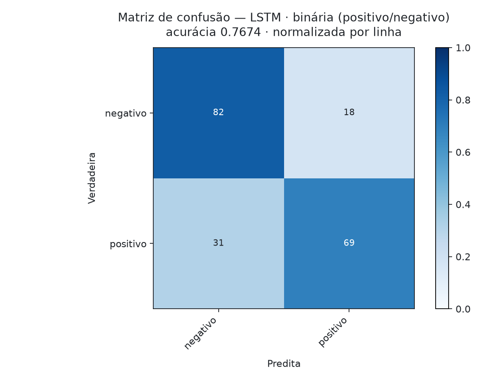
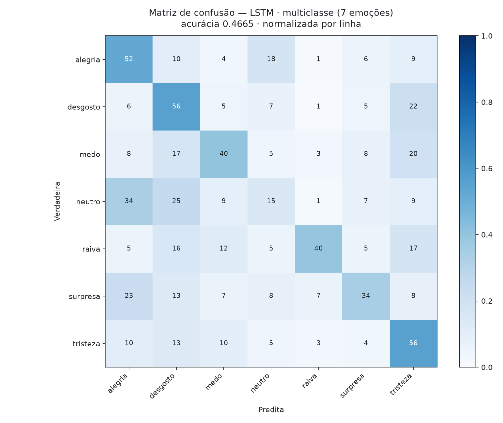
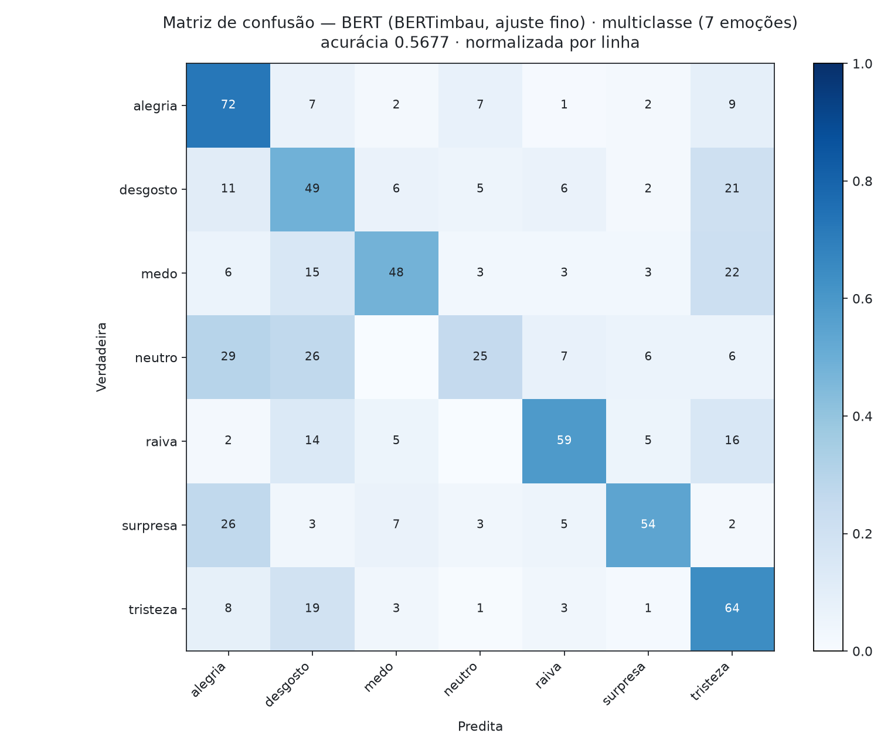

# Avaliação Prática 2 — Text Classification: LSTM vs Transformer

> **Course:** Aprendizagem de Máquina · PPGIA / PUC-PR · MSc 2026
> **Instructor:** Prof. Alceu de Souza Britto Jr. (alceu@ppgia.pucpr.br)
> **Related module:** [Module 5 — Deep Techniques](../modules/05-deep.md)
> **Code:** [`activities/avaliacao-pratica-2/`](avaliacao-pratica-2/) · **Runners:** [`colab.ipynb`](avaliacao-pratica-2/colab.ipynb) · [`kaggle.ipynb`](avaliacao-pratica-2/kaggle.ipynb)

---

## Overview

Two classification tasks over a corpus of Brazilian news headlines (G1) annotated with
emotions, and two model families compared on each:

| Task | Classes | Majority floor |
|---|---|---|
| **Binary** | positivo / negativo | **57.6%** |
| **Multiclass** | alegria · tristeza · desgosto · medo · surpresa · raiva · neutro | **24.8%** |

| Model | What it learns | What it inherits | Script |
|---|---|---|---|
| Majority class | nothing — the floor | — | [`m0_baselines.py`](avaliacao-pratica-2/m0_baselines.py) |
| TF-IDF + linear SVM | a convex decision boundary over n-grams | — | [`m0_baselines.py`](avaliacao-pratica-2/m0_baselines.py) |
| LSTM | word embeddings *and* the task, from 1,449 texts | nothing | [`m1_lstm.py`](avaliacao-pratica-2/m1_lstm.py) |
| BERT (BERTimbau) | the task; the encoder is nudged | 2.7B words of Portuguese | [`m2_bert.py`](avaliacao-pratica-2/m2_bert.py) |

The comparison the assignment asks for — LSTM vs Transformer — is **structurally
lopsided**, and saying so is part of the result:

> The LSTM has 912k trainable parameters and must learn *what words mean* from 1,449
> headlines. BERT has 109M and arrives already knowing, pretrained on brWaC. The two
> differ **simultaneously** in architecture, in capacity, and in prior knowledge of the
> language — so comparing them head-to-head cannot isolate which of the three is doing
> the work.

Which is why the classical baseline is in the table. TF-IDF + linear SVM has no
pretraining and no attention, and on 1,449 short texts it is a serious competitor. How
much of the LSTM→BERT gap it covers is *indirect* evidence about where that gap comes
from. This is the same lesson [Atividade 1](atividade-1.md) produced when a
logistic-regression baseline outranked every tree ensemble: the right inductive bias
beats the fancier algorithm.

**Design limitation, stated up front.** No Transformer was trained *without* pretraining
on this corpus — the control that would experimentally separate architecture from
pretraining. Every claim below about *why* BERT wins is therefore an inference from the
baseline, consistent with the evidence but not causally established.

---

## The corpus needs work before it can be trained on

Each of the following is a finding, not housekeeping. All are handled in
[`common.py`](avaliacao-pratica-2/common.py).

### 1. 292 duplicates (10.7%)

Concatenating `g1_v1_ws.csv` (982) and `g1_v2_ws.csv` (1,750) yields 2,732 rows but only
**2,440 distinct texts**. Splitting before de-duplicating puts a text in train and its
copy in test: the model is then scored on material it memorised, and the reported
accuracy is inflated by an amount nobody can quantify after the fact.

**De-duplication happens before the split.** It is the single most consequential line in
the codebase.

### 2. Four texts carry conflicting labels — and they are conflicting in a revealing way

Four texts appear twice with *different* emotions. Every one of the four disagreements is
negative-vs-negative:

| Text (truncated) | Labels |
|---|---|
| "atores de peça que retrata jesus como gay..." | raiva, raiva, **desgosto** |
| "furacão sandy faz obama decretar estado de emergência..." | desgosto, **medo**, medo |
| "são paulo teve noite violenta, com 11 baleados..." | tristeza, **medo** |
| "terremoto de 6,4 graus atinge sul do méxico..." | desgosto, **medo** |

The annotators never disagree about **valence** — only about *which* negative emotion.
So the binary task is clean, and the multiclass task carries **irreducible label noise**
concentrated exactly where its confusion matrix will bleed: among fear, disgust, anger
and sadness. The four texts are dropped from every task, leaving **2,436**.

### 3. The binary mapping is a decision the assignment does not make

The lecture notebook defines it:

```python
{'neutro':'positivo', 'alegria':'positivo', 'surpresa':'positivo',
 'medo':'negativo', 'raiva':'negativo', 'desgosto':'negativo', 'tristeza':'negativo'}
```

`neutro → positivo` is semantically strained — *neutral is not positive* — and `surpresa`
has no fixed valence (surprise can be delight or horror). The instructor's map is used
for the headline result, because it is what makes the number comparable to the rest of
the class. A **sensitivity analysis** (`--task binary_valence`) re-runs the task with
`neutro` and `surpresa` dropped. If the LSTM-vs-BERT verdict survives both, it does not
rest on a labelling choice we did not make.

### 4. Encoding

The files are **latin-1**, not UTF-8, with `;` delimiters and a quoted junk column
(`texto;";";classe`). Read as UTF-8 they raise; read carelessly they yield mojibake, and
the LSTM then learns a vocabulary of corrupted tokens.

---

## Experimental Protocol

**Holdout 70/30, as prescribed** — plus three corrections the lecture script needs:

1. **Stratified.** With `raiva` down to 196 examples after de-duplication, an
   unstratified split can hand the test set a class balance training never saw; macro-F1
   would then measure the split rather than the model.
2. **A real validation set.** The lecture script passes its 30% holdout as
   `validation_data` *and* reports accuracy on it — model selection on the test set. Here
   early stopping watches a 15% slice carved out of the training 70%, and **the test set
   is read exactly once**.
3. **Three seeds.** A ~730-text test set has a binomial standard error of ~1.5 pp. One
   split can rank two models by luck; the baseline alone swings **51.2% → 55.3%** across
   seeds on the multiclass task. Every claim is mean ± sd over seeds (42, 7, 2024).

**Significance:** exact **McNemar** on paired test predictions. The LSTM and BERT see
identical test texts, so their errors are paired and only the discordant pairs carry
information — a 3 pp gap here is about 22 texts, and no amount of eyeballing two
accuracies will tell you whether that is signal.

**Preprocessing differs by model, on purpose.** The LSTM gets stopwords removed (with
1,449 texts and randomly-initialised embeddings, there is not enough signal to learn that
*de* is uninformative). BERT gets **raw text**: it was pretrained on running Portuguese,
and deleting *não* from *não gostei* inverts the sentiment. The preprocessing that helps
one model destroys the other.

---

## Results

> Generated by [`report.py`](avaliacao-pratica-2/report.py) from
> [`avaliacao-pratica-2/results/`](avaliacao-pratica-2/results/). Every run persists its
> test predictions, so the tables, confusion matrices and McNemar test regenerate on CPU.

### Task 1 — Binary (positivo / negativo)

<!-- BEGIN GENERATED: table-binary -->
| Model | Accuracy | Δ floor | Macro-F1 | Weighted-F1 | 95% CI | Trainable params | Train |
|---|---|---|---|---|---|---|---|
| BERT (BERTimbau, fine-tuned) <sub>(3 seeds)</sub> | **0.8285 ± 0.0235** | +25.2 pp | 0.8203 ± 0.0289 | 0.8261 | 0.7712–0.8698 | 108,924,674 | 33s |
| TF-IDF + linear SVM *(classical baseline)* <sub>(3 seeds)</sub> | **0.7957 ± 0.0084** | +21.9 pp | 0.7893 ± 0.0091 | 0.7949 | 0.7554–0.8302 | 35,955 | 1s |
| BiLSTM | **0.7798** | +20.3 pp | 0.7743 | 0.7796 | 0.7483–0.8083 | 1,313,986 | 19s |
| LSTM <sub>(3 seeds)</sub> | **0.7711 ± 0.0114** | +19.5 pp | 0.7641 ± 0.0138 | 0.7702 | 0.7298–0.8122 | 911,554 | 10s |
| Majority class *(floor)* <sub>(3 seeds)</sub> | **0.5759 ± 0.0000** | -0.0 pp | 0.3655 ± 0.0000 | 0.4209 | 0.5398–0.6113 | 0 | 0s |
<!-- END GENERATED: table-binary -->

**LSTM vs BERT, paired:**

<!-- BEGIN GENERATED: significance-binary -->
| Discordant | LSTM right / BERT wrong | LSTM wrong / BERT right | p (exact McNemar) |
|---|---|---|---|
| 133 | 38 | 95 | 8.25e-07 |

The 7.80 pp gap between **BERT** and the other is **significant** (α = 0.05, exact McNemar on paired test predictions).
<!-- END GENERATED: significance-binary -->

| LSTM | BERT |
|:---:|:---:|
|  |  |

*Row-normalised, primary seed. Both models are shown, not just the winner: two models at different accuracies can be wrong in the same places, and that is what the side-by-side reveals.*

### Task 2 — Multiclass (7 emotions)

<!-- BEGIN GENERATED: table-multiclass -->
| Model | Accuracy | Δ floor | Macro-F1 | Weighted-F1 | 95% CI | Trainable params | Train |
|---|---|---|---|---|---|---|---|
| BERT (BERTimbau, fine-tuned) <sub>(3 seeds)</sub> | **0.5741 ± 0.0360** | +32.6 pp | 0.5378 ± 0.0488 | 0.5650 | 0.5055–0.6475 | 108,928,519 | 39s |
| TF-IDF + linear SVM *(classical baseline)* <sub>(3 seeds)</sub> | **0.5303 ± 0.0208** | +28.2 pp | 0.4946 ± 0.0115 | 0.5283 | 0.4754–0.5883 | 35,617 | 1s |
| BiLSTM | **0.4720** | +22.4 pp | 0.4060 | 0.4592 | 0.4360–0.5082 | 1,314,311 | 23s |
| LSTM <sub>(3 seeds)</sub> | **0.4615 ± 0.0190** | +21.4 pp | 0.4119 ± 0.0121 | 0.4620 | 0.4049–0.5137 | 911,879 | 20s |
| Majority class *(floor)* <sub>(3 seeds)</sub> | **0.2476 ± 0.0000** | -0.0 pp | 0.0567 ± 0.0000 | 0.0983 | 0.2177–0.2802 | 0 | 0s |
<!-- END GENERATED: table-multiclass -->

**LSTM vs BERT, paired:**

<!-- BEGIN GENERATED: significance-multiclass -->
| Discordant | LSTM right / BERT wrong | LSTM wrong / BERT right | p (exact McNemar) |
|---|---|---|---|
| 234 | 80 | 154 | 1.505e-06 |

The 10.12 pp gap between **BERT** and the other is **significant** (α = 0.05, exact McNemar on paired test predictions).
<!-- END GENERATED: significance-multiclass -->

| LSTM | BERT |
|:---:|:---:|
|  |  |

*Row-normalised, primary seed. Both models are shown, not just the winner: two models at different accuracies can be wrong in the same places, and that is what the side-by-side reveals.*

### Sensitivity — does the binary result depend on `neutro`/`surpresa` being "positive"?

<!-- BEGIN GENERATED: sensitivity -->
| Mapping | LSTM | BERT | Note |
|---|---|---|---|
| binary (positive/negative) | 0.7711 ± 0.0114 | 0.8285 ± 0.0235 | instructor's map (`neutro`, `surpresa` → positive) |
| binary, valence-clean | 0.8358 | 0.8972 | `neutro`/`surpresa` dropped |

<!-- END GENERATED: sensitivity -->

---

## Reproducing

The corpus is instructor-provided and **not committed** to this repository. Place
`g1_v1_ws.csv` and `g1_v2_ws.csv` in `avaliacao-pratica-2/data/` (the Colab notebook has
an upload cell).

```bash
cd activities/avaliacao-pratica-2
pip install -r requirements.txt

python run_all.py --stage core         # both tasks x 4 models, primary seed (~8 min, T4)
python run_all.py --stage seeds        # seeds 7 and 2024                    (~15 min)
python run_all.py --stage sensitivity  # binary without neutro/surpresa      (~3 min)
python run_all.py --stage extras       # BiLSTM                              (~3 min)
python report.py                       # tables + confusion matrices         (~5 s, CPU)
```

The baselines run on CPU in seconds — useful for validating the data pipeline before
spending a GPU minute on anything.

**Two runners, deliberately.** [`colab.ipynb`](avaliacao-pratica-2/colab.ipynb) and
[`kaggle.ipynb`](avaliacao-pratica-2/kaggle.ipynb) call the identical scripts; they differ
only in how the corpus arrives (Colab upload widget vs. a Kaggle private dataset). Kaggle's
free GPU quota is independent of Colab's, so this activity can train on Kaggle while
[Avaliação Prática 1](avaliacao-pratica-1.md) occupies the Colab GPU.

---

*[← README](../README.md) · [Module 5 — Deep Techniques](../modules/05-deep.md) · [Answers (pt-BR)](avaliacao-pratica-2-respostas.md)*


<!-- BEGIN GENERATED: pairwise-binary -->
| Comparison | Δ | p (McNemar) | Significant? |
|---|---|---|---|
| BERT (BERTimbau, fine-tuned) vs. TF-IDF + linear SVM | +4.24 pp | 0.00239 | **yes** |
| TF-IDF + linear SVM vs. LSTM | +3.56 pp | 0.00734 | **yes** |
| BERT (BERTimbau, fine-tuned) vs. LSTM | +7.80 pp | 8.25e-07 | **yes** |
| BiLSTM vs. LSTM | +1.23 pp | 0.336 | no — technical tie |
<!-- END GENERATED: pairwise-binary -->


<!-- BEGIN GENERATED: pairwise-multiclass -->
| Comparison | Δ | p (McNemar) | Significant? |
|---|---|---|---|
| BERT (BERTimbau, fine-tuned) vs. TF-IDF + linear SVM | +5.61 pp | 0.00426 | **yes** |
| TF-IDF + linear SVM vs. LSTM | +4.51 pp | 0.00184 | **yes** |
| BERT (BERTimbau, fine-tuned) vs. LSTM | +10.12 pp | 1.51e-06 | **yes** |
| BiLSTM vs. LSTM | +0.55 pp | 0.769 | no — technical tie |
<!-- END GENERATED: pairwise-multiclass -->


<!-- BEGIN GENERATED: per-class-multiclass -->
| Class | F1 |
|---|---|
| alegria | 0.686 |
| tristeza | 0.606 |
| surpresa | 0.589 |
| raiva | 0.576 |
| medo | 0.517 |
| desgosto | 0.478 |
| neutro | 0.309 |
<!-- END GENERATED: per-class-multiclass -->


<!-- BEGIN GENERATED: confusions-multiclass -->
| Confusion | Rate |
|---|---|
| neutro → alegria | 29.4% |
| neutro → desgosto | 26.5% |
| surpresa → alegria | 26.2% |
| medo → tristeza | 21.5% |
| desgosto → tristeza | 20.8% |
| tristeza → desgosto | 18.8% |
<!-- END GENERATED: confusions-multiclass -->
